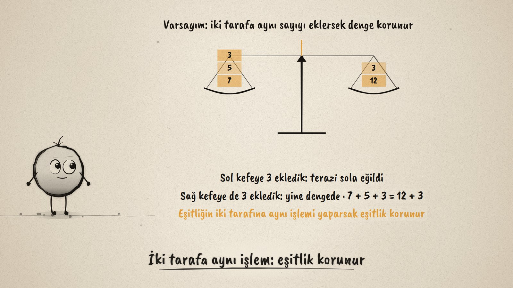
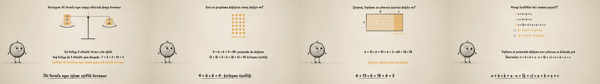

# Terazi Dengede · Equality and Properties of Operations

**▶ Tarayıcıda izleyin / Watch in the browser:** https://hakanatas.github.io/terazi-dengede/ 
**⬇ MP4 + altyazılar / MP4 + subtitles:** [Releases](https://github.com/hakanatas/terazi-dengede/releases) 
**✎ Kullanılan istem / The prompt behind it:** [PROMPT.md](PROMPT.md) 
**🎞 Bütün filmler / All films:** [Nokta'nın Filmleri](https://hakanatas.github.io/nokta-filmleri/?sinif=5)

> **TR —** 5. sınıf matematik "İşlemlerle Cebirsel Düşünme" temasındaki MAT.5.2.1 öğrenme çıktısı için hazırlanmış, tamamen JavaScript ile çizilen 92 saniyelik mürekkep animasyonu. Terazinin kefelerinde 7 + 5 ile 12 var ve terazi dengede. Varsayım: iki tarafa aynı sayıyı eklersek denge korunur. Sol kefeye 3 eklenince terazi eğiliyor, sağa da 3 eklenince yeniden dengeleniyor: eşitliğin iki tarafına aynı işlem yapılırsa eşitlik korunur. Kefedeki 3 ile 5'in yeri değişiyor, denge bozulmuyor (değişme); 4 × 6'lık nokta dizisi dönüp 6 × 4 oluyor; (2 + 8) + 5 = 2 + (8 + 5) (birleşme). 6 × 13'lük dikdörtgen 10 ve 3'e ayrılıyor: 6 × 10 + 6 × 3 = 78; 6 × 9 = 6 × 10 − 6 × 1 = 54 (dağılma). Genellemeler sınanıyor: değişme çıkarma ve bölmede geçerli değil. Önermeler sembolle yazılıyor ve zihinden işlemdeki katkısı gösteriliyor. Altyazılar Türkçe, İngilizce ya da ikisi birlikte seçilebilir.

A 92-second ink animation for **5th-grade maths**. Nokta, the ink character from [The Learning Ink](https://github.com/hakanatas/the-learning-ink), is the guide again. The balance is not animated by hand: its tilt is computed from the difference between the weights on its two pans (`balance` in `scenes/scene1.js`), so it leans the moment one side gets more and levels as soon as the other side catches up.

## Learning outcome

MEB, Türkiye Yüzyılı Maarif Modeli, Ortaokul Matematik, 5th grade, "İşlemlerle Cebirsel Düşünme" theme:

**MAT.5.2.1. Eşitliğin korunumuna ve işlem özelliklerine yönelik çıkarım yapabilme**
- a) Eşitliğin korunumuna, doğal sayılarla toplama ve çarpma işlemlerinin değişme, birleşme; çarpmanın toplama ve çıkarma işlemleri üzerine dağılma özelliklerine yönelik varsayımlarda bulunur.
- b) İncelediği örnekler üzerinden varsayımına yönelik genellemeleri belirler.
- c) Elde ettiği genellemelerin varsayımını karşılayıp karşılamadığını çeşitli örnekler üzerinden sınar.
- ç) Varsayımı ile ilgili ulaştığı sonuca yönelik doğrulayabileceği matematiksel bir önermeyi sözel ve sembolik temsil ile sunar.
- d) Sunduğu önermenin katkısına yönelik gerekçe sunar.

## Scenes

| # | Time | Scene | What happens | Outcome |
|---|---|---|---|---|
| 1 | 0–10 s | Terazi | 7 + 5 on one pan, 12 on the other: level. | a |
| 2 | 10–28 s | Eşitliğin korunumu | 3 on one side tips it; 3 on both keeps it level. | a, b |
| 3 | 28–46 s | Değişme ve birleşme | 3 and 5 swap places; a 4 × 6 array turns into 6 × 4; (2 + 8) + 5 = 2 + (8 + 5). | a, b |
| 4 | 46–64 s | Dağılma | 6 × 13 = 6 × 10 + 6 × 3; 6 × 9 = 6 × 10 − 6 × 1. | a, b |
| 5 | 64–80 s | Sına ve öner | Swapping fails for − and ÷; the properties in symbols; why they help mental maths. | c, ç, d |
| 6 | 80–92 s | Aklında kalsın | Keep the balance, use the properties. | ç, d |

## Running it

- **Preview:** double-click `index.html` (it works offline).
- **MP4:** run `npm install` once, then `npm run export -- --format=horizontal --captions=tr`.
- **Subtitles and narration:** `npm run srt` writes `out/captions_*.srt` and `narration_notes.txt`.
- **Editing:**
  - Caption text, timings and narration notes: `captions.js`
  - Everything on screen is drawn by `LI.world(t)` in `scenes/scene1.js` (the weights in `LEFT` and `RIGHT`, the array, the rectangle, the list of properties, the words); the other scenes only set the camera.
  - Nokta's poses: `src/draw/film.js`; layout for 16:9 and 9:16: `src/draw/kd.js`

It uses the same engine as The Learning Ink: `renderFrame(t)` as a pure function of time, seeded randomness, and frame-by-frame export.

## Lisans · License

**TR —** Bu film ve kodu [Creative Commons Atıf-GayriTicari 4.0 Uluslararası (CC BY-NC 4.0)](https://creativecommons.org/licenses/by-nc/4.0/deed.tr) lisansıyla paylaşılır. Ticari olmayan her amaçla (derste, okulda, eğitim materyalinde) kopyalayabilir, paylaşabilir ve değiştirebilirsiniz; ancak **kaynak göstermek zorunludur**: eser sahibinin adı ve bu deponun bağlantısı belirtilmeden kullanılamaz. Ticari kullanım (satış, ücretli ürün ya da yayın) için izin alınmalıdır.

**EN —** This film and its code are licensed under [Creative Commons Attribution-NonCommercial 4.0 International (CC BY-NC 4.0)](https://creativecommons.org/licenses/by-nc/4.0/). You may copy, share and adapt them for non-commercial purposes, but **attribution is required**: they may not be used without crediting the author and linking to this repository. Commercial use requires permission.

Atıf örneği / Required credit: *“Terazi Dengede”, Hakan Ataş, Nokta'nın Filmleri — https://github.com/hakanatas/terazi-dengede — CC BY-NC 4.0*
